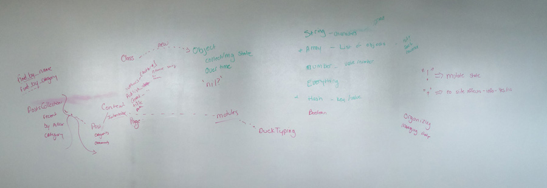

# Week Three - More Ruby & Math

## Summary

### Maths

One thing I noticed while working on the Koans, especially the Greed Koan, is that I need to brush up on my math skills. Thus far I haven't really had to use a whole lot of math on my life, just simple stuff, but if I'm going to become a good developer I need to know the maths.

I found a really interesting article about [math for developers](http://steve-yegge.blogspot.in/2006/03/math-for-programmers.html) that talks about probability theory which is a branch of discrete math that I will most likely need to know. With the little bit of programming I have done, most of the math I have needed has been probability theory and I have either had to look up someone elses solution or find a different way to work around the problem. I don't think I can keep doing this and still be successful with ruby moving forward.

### Object Oriented Programming

This week we started talking about a programming methodology that I thought I had a basic understanding of but after our meeting I realized there is a lot I don't know, or better yet misunderstand. Years ago I took an intro to programming class where they tried to teach the basics of OOP but at the time it was over my head so I just dismissed a lot of the things I didn't understand, like classes.

As I learn more I'm starting to rethink how I would structure some of the side projects I want to eventually work on, especially the Ruby Flat File CMS I want to build.

 

### Lastly...

Overall this was kind of a slow week for me. I felt like I wasn't retaining information and was at times very confused and I don't think I really got anything accomplished. I think I just need to take a weekend away from the computer and come back Monday refreshed.

##Helpful Resources

* [Ruby in Twenty Minutes](https://www.ruby-lang.org/en/documentation/quickstart/) *Thanks [@danrosenthal](https://github.com/danrosenthal)*

##Notes

* [Ruby](../notes/ruby/README.md)
* [Discrete Mathematics & Probability Theory](../notes/maths.md)